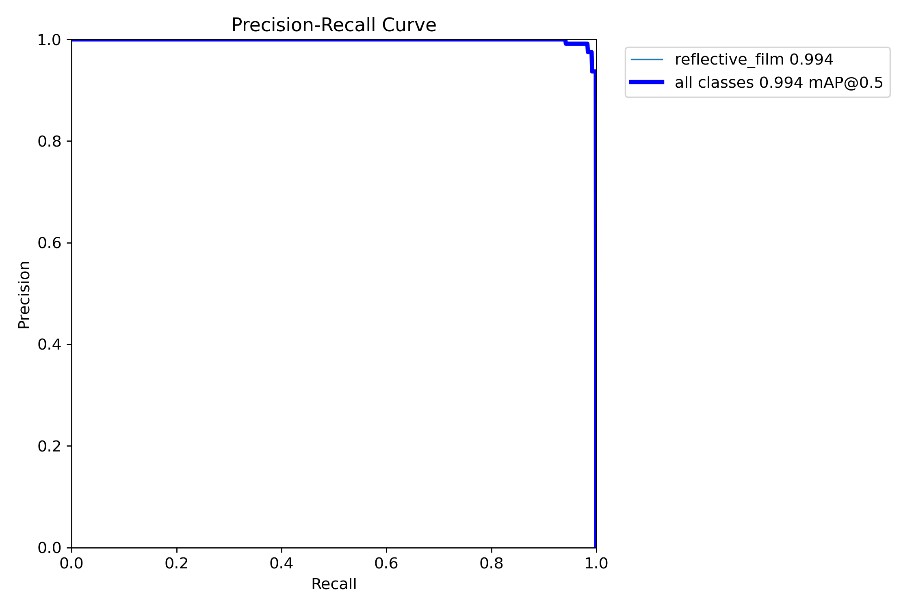
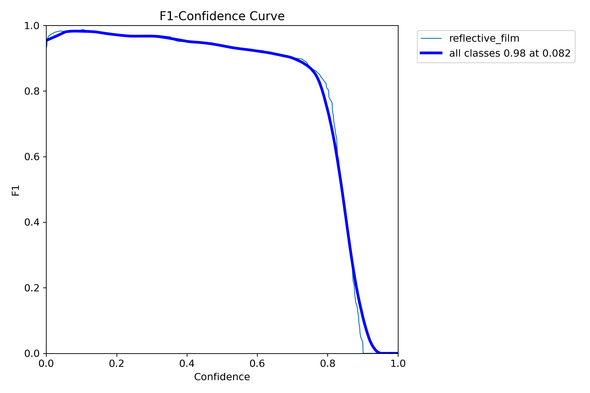
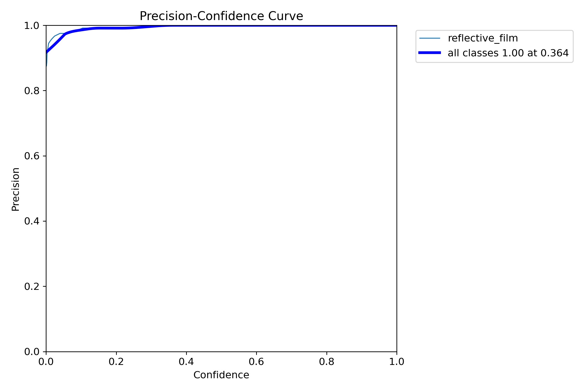
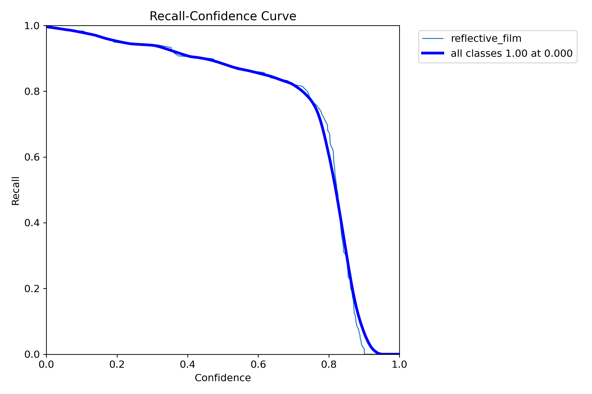
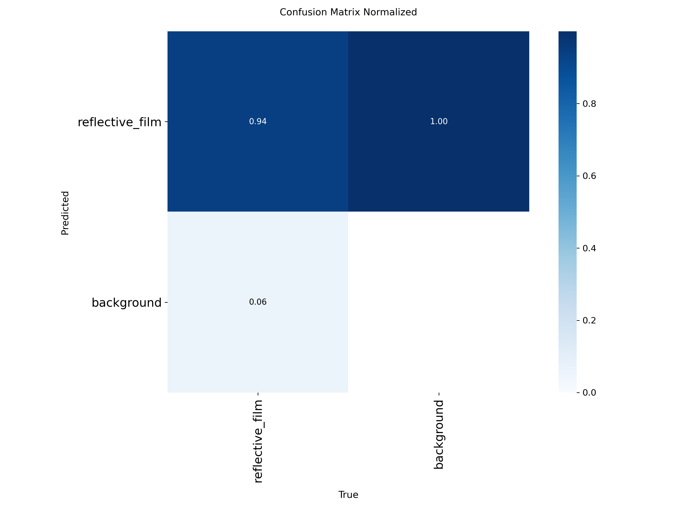
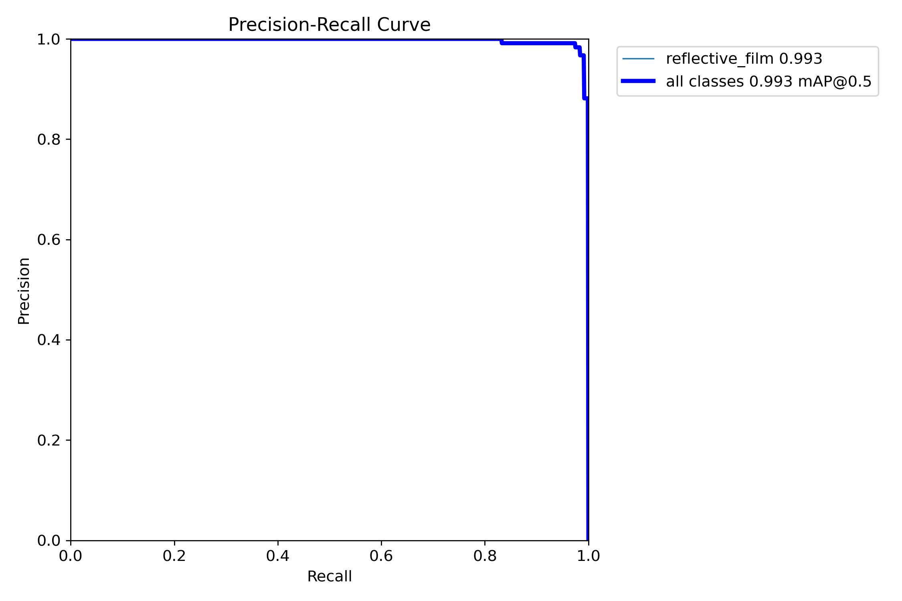
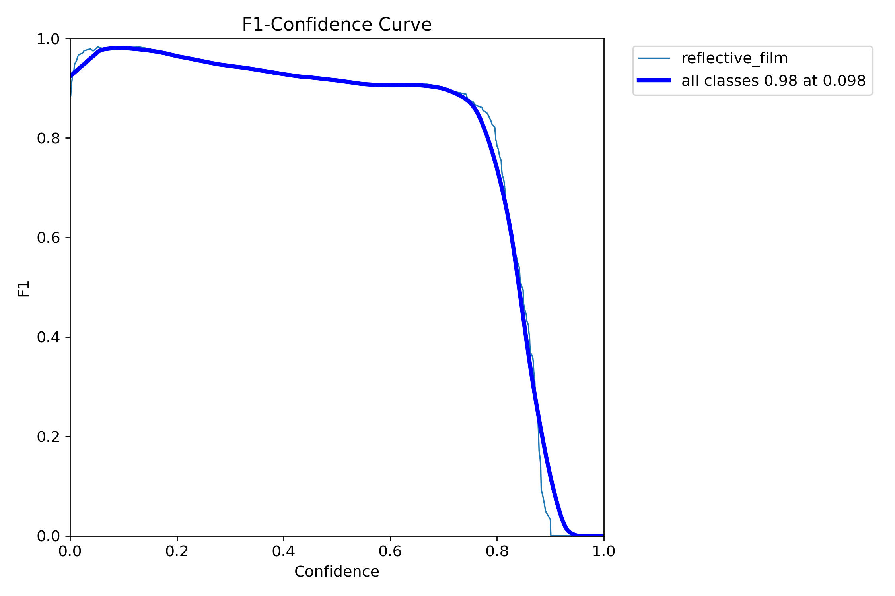
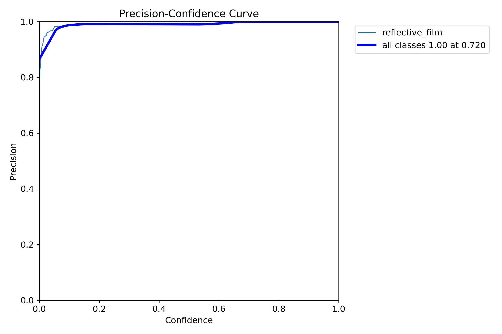
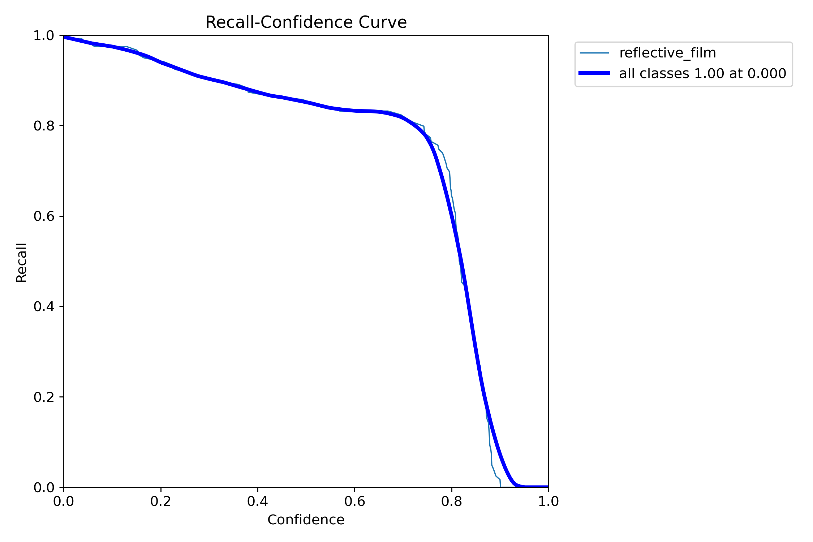
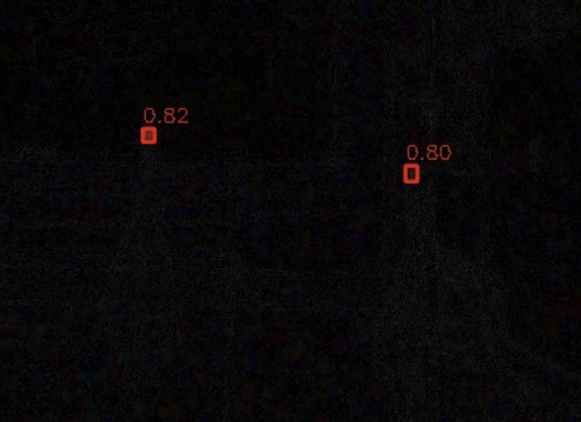

# YOLO 재귀반사 필름(적색) 탐지기

**Ultralytics YOLO 기반 적색 재귀반사 필름 탐지 모델**  
RGB 원본 영상과 LED 차분(Diff) 영상 모델을 제공합니다.

---

## 성능 요약

| 모델 타입 | 베스트 모델 | mAP@0.5 | Precision | Recall | 특징 |
|:---:|:---:|:---:|:---:|:---:|:---|
| **Original (RGB)** | **YOLOv11m** | **0.935** | 0.98 | 0.81 | 일반 주간/실내 환경 |
| **Diff (Robust)** | **YOLOv11m_Diff** | **0.994** | **0.99** | **0.98** | 강한 주변광, 야간, 원거리 |
| **Diff (Nano)** | **YOLOv11n_Diff** | **0.991** | **0.98** | **0.97** | 경량화, 엣지 디바이스 |

---

## 모델 상세

### 1. Diff 모델 (차분 영상)
> **학습 데이터**: `(LED ON - LED OFF)` 차분 이미지  
> **특징**: 배경 노이즈 제거, 주변광 간섭 최소화

<b>▼ Diff 모델 그래프 확인</b>

#### YOLOv11m_Diff (Main)
* **mAP@50**: 0.994
* **Precision**: 0.99 | **Recall**: 0.98

| Precision-Recall | F1-Confidence |
|:---:|:---:|
|  |  |
| **Precision-Confidence** | **Recall-Confidence** |
|  |  |

    
    
Confusion Matrix (Normalized)

 

#### YOLOv11n_Diff (Nano)
* **mAP@50**: 0.991
* **Precision**: 0.98 | **Recall**: 0.97

| Precision-Recall | F1-Confidence |
|:---:|:---:|
|  |  |
| **Precision-Confidence** | **Recall-Confidence** |
|  |  |

 

#### YOLOv11n_Diff_KD (Nano + Knowledge Distillation)
* **mAP@50**: 0.993
* **Precision**: 0.98 | **Recall**: 0.97
* **특징**: YOLOv11m_Diff를 Teacher로 사용한 지식 증류

 

#### 상세 지표
| 모델 | mAP@0.5 | Precision | Recall | 비고 |
|:---|:---:|:---:|:---:|:---:|
| **YOLOv11m_Diff** | **0.994** | **0.99** | **0.98** | 최고 성능 |
| **YOLOv11n_Diff** | **0.991** | **0.98** | **0.97** | 경량화 |
| **YOLOv11n_Diff_KD** | **0.993** | **0.98** | **0.97** | KD 적용 |

 

### 2. Original 모델 (RGB 영상)
> **학습 데이터**: 표준 RGB 이미지  
> **특징**: 통제된 조명 환경에서 높은 정확도

<b>▼ Original 모델 그래프 확인</b>

#### YOLOv11m (Main)
* **mAP@0.5**: 0.935
* **Best F1**: 0.91

| Precision-Recall | F1-Confidence |
|:---:|:---:|
|  |  |
| **Precision-Confidence** | **Recall-Confidence** |
|  |  |

    
    
Confusion Matrix (Normalized)

 

#### YOLOv11s (Light)
* **mAP@0.5**: 0.931
* **Best F1**: 0.91

| Precision-Recall | F1-Confidence |
|:---:|:---:|
|  |  |

 

#### YOLOv8m (Baseline)
* **mAP@0.5**: 0.808
* **Best F1**: 0.76

| Precision-Recall | F1-Confidence |
|:---:|:---:|
|  |  |

---

## 테스트 예시

