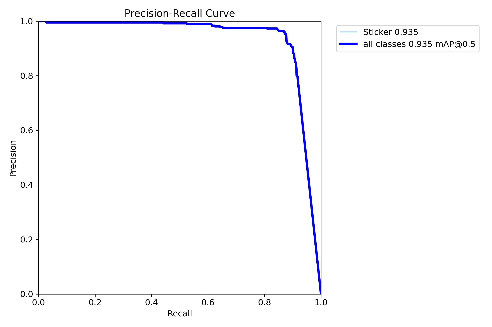
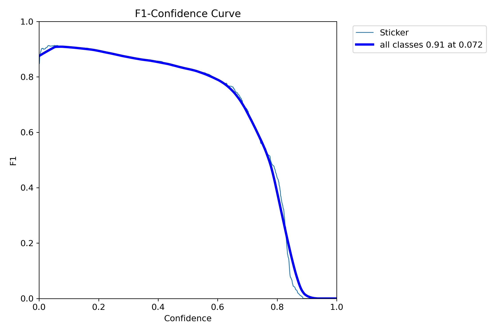
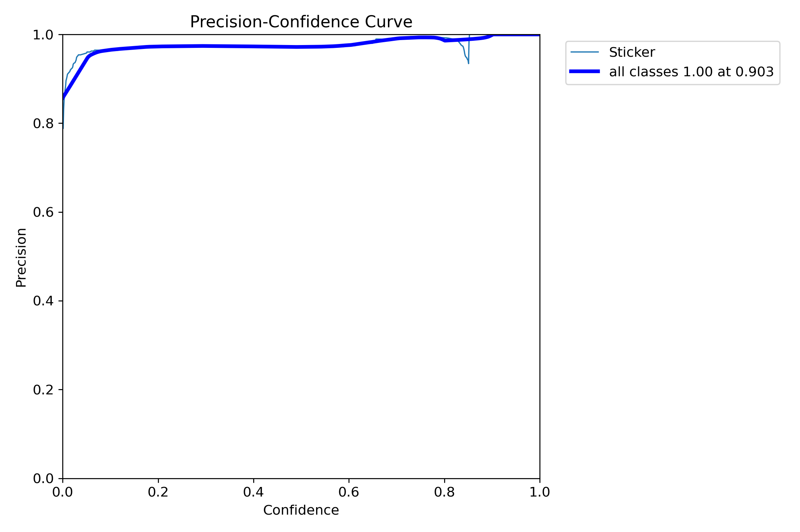
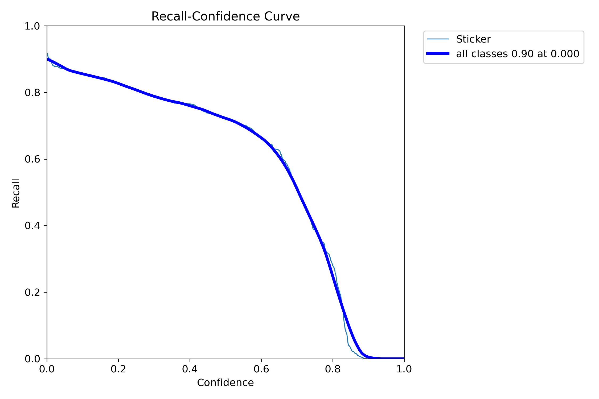
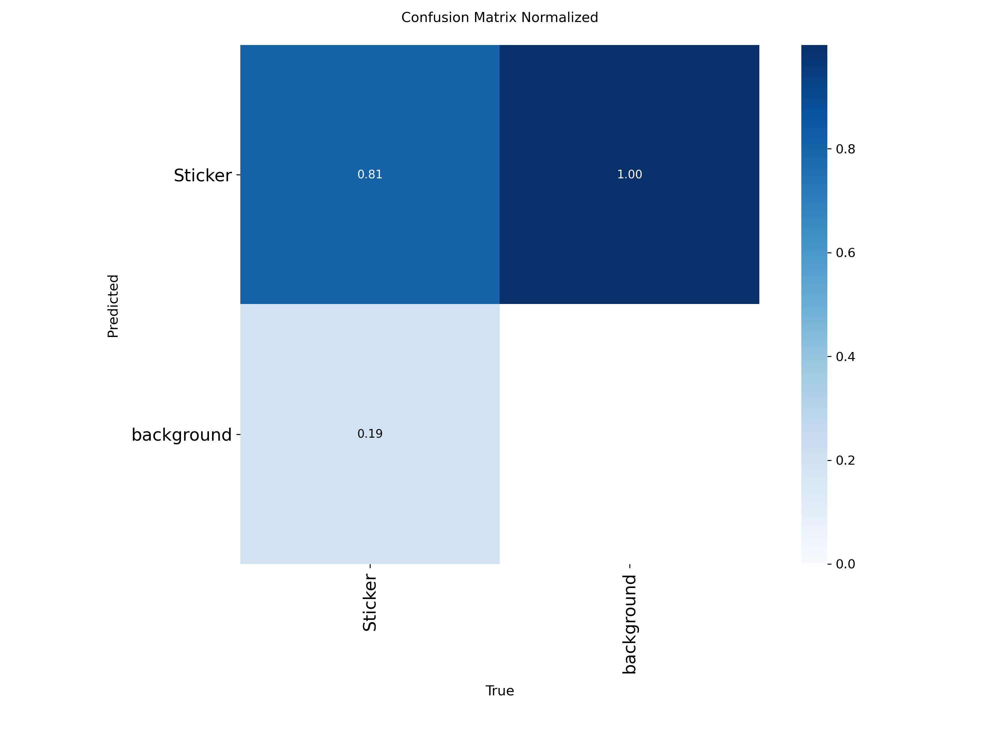
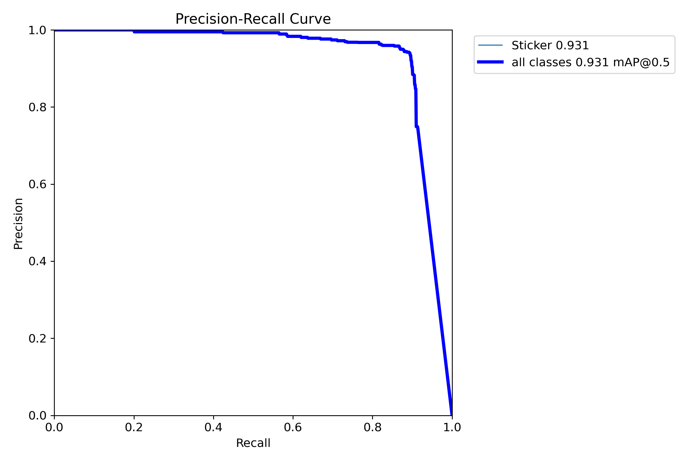
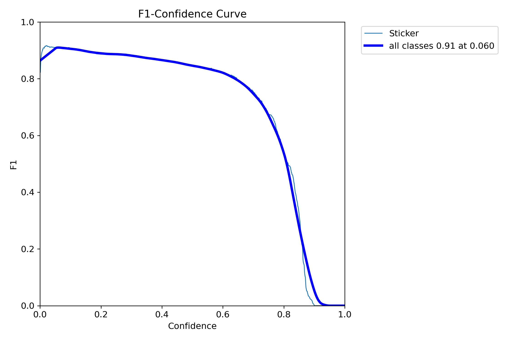
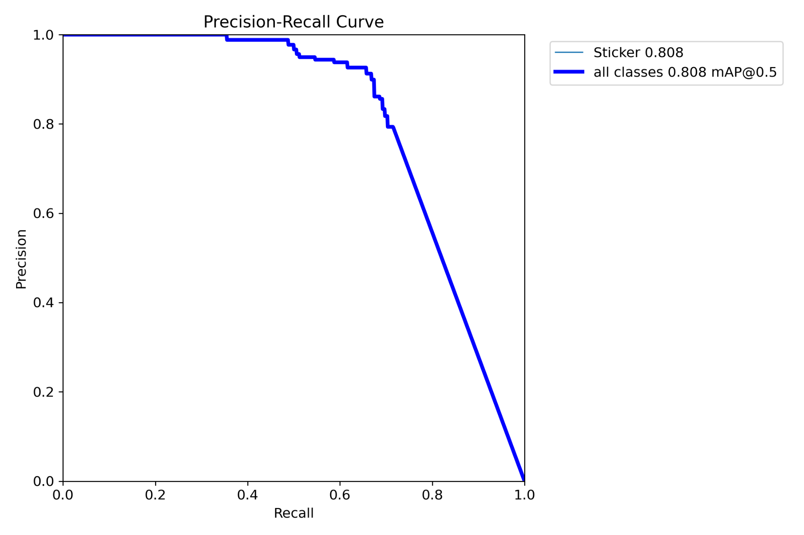
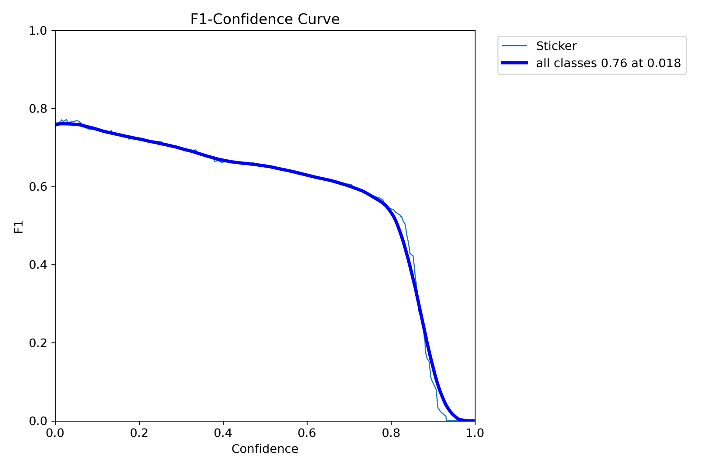
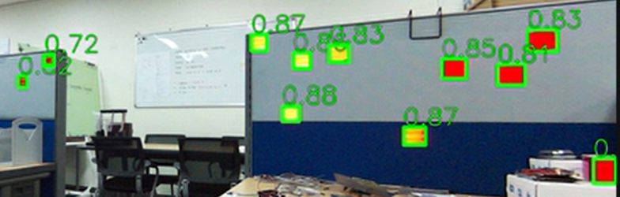

# 🎯 YOLO Retroreflective Film (RED) Detector

**High-precision detector for Red Retroreflective Film using Ultralytics YOLO.**  
Supports both **RGB Original** images and **LED Difference** images for robust detection in various lighting conditions.

---

## 📊 Performance Overview

| Model Type | Best Model | mAP@0.5 | Precision | Recall | Recommended For |
|:---:|:---:|:---:|:---:|:---:|:---|
| **Original (RGB)** | **YOLOv11m** | **0.935** | 0.98 | 0.81 | General Purpose, Day/Indoor |
| **Diff (Robust)** | **YOLOv11m_Diff** | *TBD* | *TBD* | *TBD* | **Strong Ambient Light**, Night, Long Range |

---

## 📂 Model Gallery

### ✨ Diff Model (Difference Image)
> **Robustness Choice** 🛡️  
> Trained on `(LED ON - LED OFF)` difference images. Extremely effective at removing background noise and ambient light interference.

<b>🔻 Click to expand Diff Model Graphs</b>

| **YOLOv11m_Diff (Main)** | **YOLOv11s_Diff (Light)** |
|:---:|:---:|
| **TBD** *(Graphs will be added)* | **TBD** *(Graphs will be added)* |

#### Performance Table (Diff)
| Model | mAP@0.5 | F1-Score | Precision | Recall |
|:---|:---:|:---:|:---:|:---:|
| **YOLOv11m_Diff** | - | - | - | - |
| **YOLOv11s_Diff** | - | - | - | - |

 

### 🧱 Original Model (RGB Image)
> **Standard Choice** 📷  
> Trained on standard RGB images. High accuracy in controlled environments.

<b>🔻 Click to expand Original Model Graphs</b>

#### YOLOv11m (Main)
> **mAP@0.5**: 0.935 | **Best F1**: 0.91

| Precision-Recall | F1-Confidence |
|:---:|:---:|
|  |  |
| **Precision-Confidence** | **Recall-Confidence** |
|  |  |

    
    
Normalized Confusion Matrix

 

#### YOLOv11s (Light)
> **mAP@0.5**: 0.931 | **Best F1**: 0.91

| Precision-Recall | F1-Confidence |
|:---:|:---:|
|  |  |

 

#### YOLOv8m (Baseline)
> **mAP@0.5**: 0.808 | **Best F1**: 0.76

| Precision-Recall | F1-Confidence |
|:---:|:---:|
|  |  |

---

## 🧪 Test Sample

